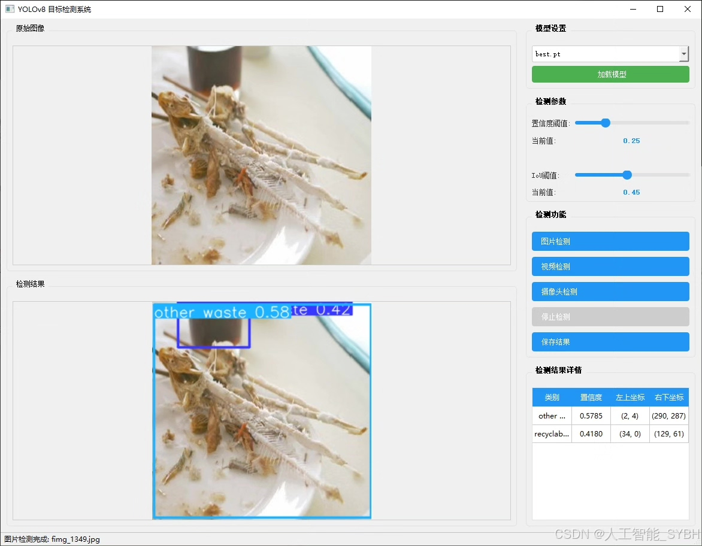
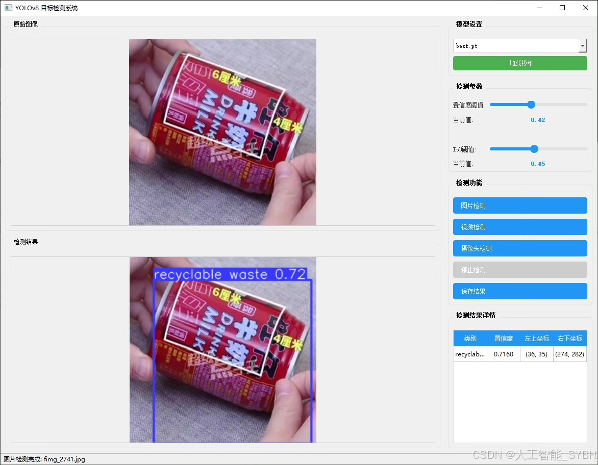
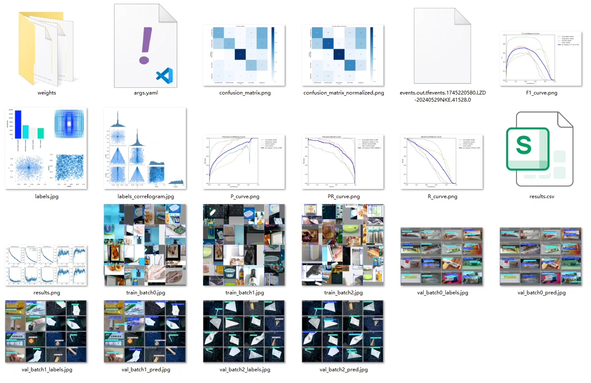
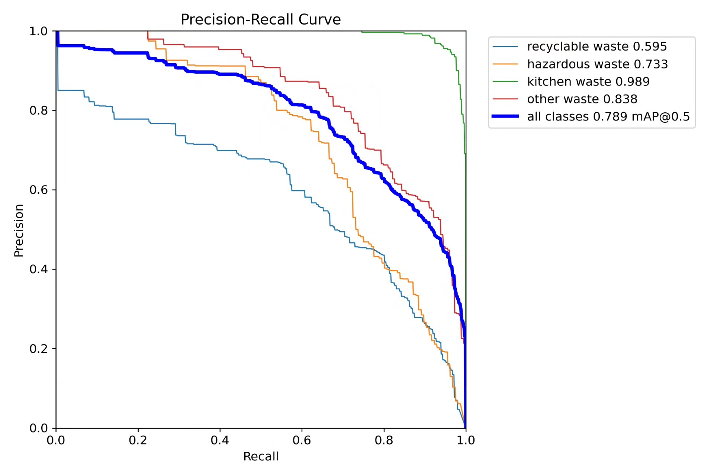
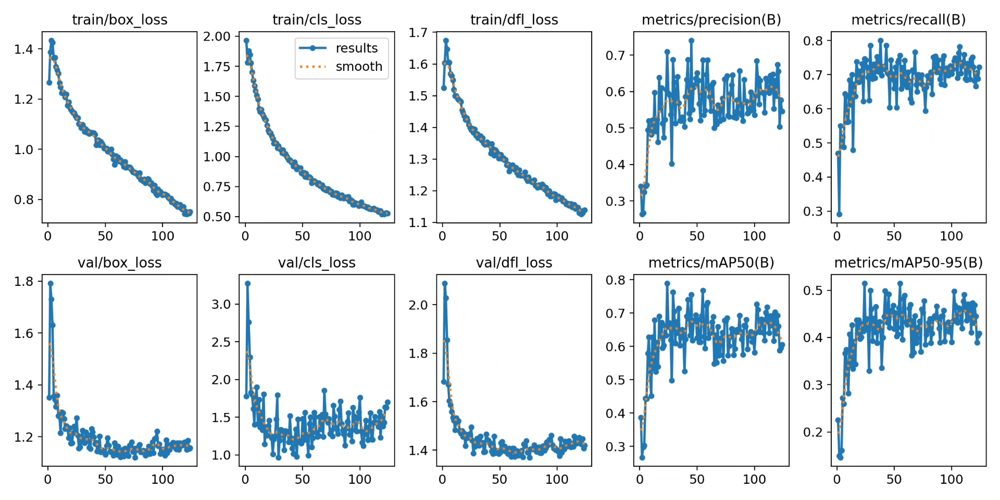
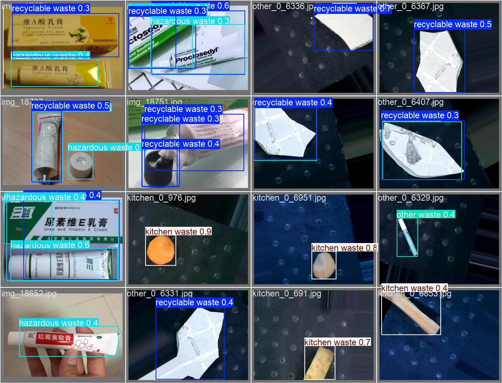
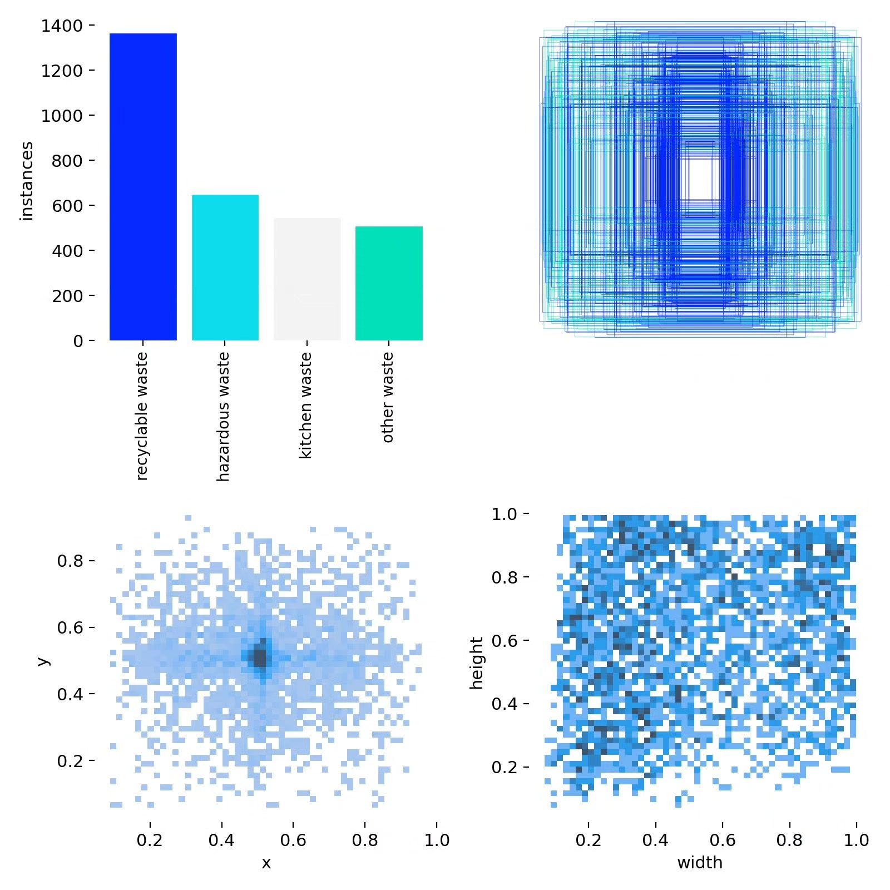
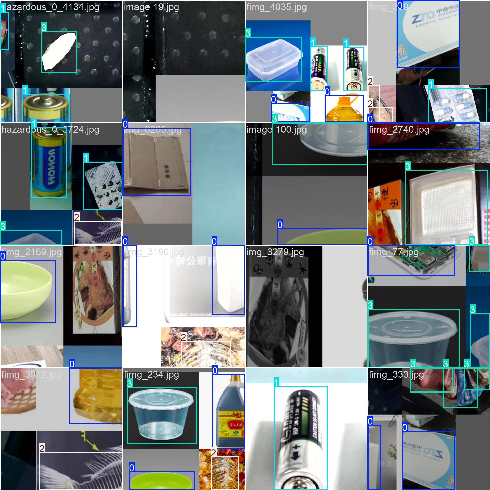

# Based on YOLOv8 deep learning for garbage classification detection system (YOLOv8+Y)

## Body

This project is based on the advanced YOLOv8 object detection algorithm, developing a high-efficiency and accurate intelligent waste sorting detection system. The system recognizes and classifies four common types of waste (recyclables, hazardous waste, kitchen waste, and other waste) through the use of a dataset containing 2743 images (1910 training images, 833 validation images). The system can detect waste items in real-time from image or video streams and accurately classify them into the corresponding categories, providing technical support for intelligent waste sorting. The project employs deep learning techniques, enhancing classification accuracy through data augmentation and model optimization, achieving high recognition precision on the validation set. This system can be deployed in scenarios such as smart trash cans and waste processing centers to aid in the automation and intelligence of waste sorting.

The company's products have obtained YOLO official commercial license certification.

We provide after-sales service:

After payment, we will provide WeChat ID for any questions.

Environmental configuration: We will provide a tutorial on environmental configuration, and WeChat will provide answers.

Remote installation service: If you need remote configuration, an additional fee of 69 is required, with all fees refunded if the configuration fails (only refund installation fees for older computers).

Retraining dataset: After setting up the environment, you can train on your own computer. If you need us to retrain, just pay 69 plus computing power fees (2.5 yuan/hour).

Full after-sales service

## Images

## Payment

Here is a pay link on Stripe ( https://buy.stripe.com/3cs8yP7sY87d0vu9AB ). Please contact me lonlonago@foxmail.com after funding $89, and I will send you a complete data files , thank you!

